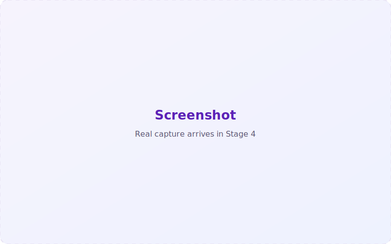

This walkthrough takes you from a blank MetaProc workspace to a finished forest plot,
a GRADE summary of findings, and an exported report you can re-run anywhere — in about
ten minutes. You do not need to write any R.

> **You'll need:** just the web app. Open MetaProc and you're ready. (Prefer to install?
> See [Web vs desktop](/docs/web-vs-desktop).)

## 1. Load the example data

You don't need your own dataset to follow along. On the **Data** tab, choose **Load
bundled example** (`example_pairwise.csv`) — a small binary-outcome dataset with event
counts and totals per arm.

MetaProc reads the file, shows **rows / columns / missing-value** boxes, and renders a
preview table. It also runs a few quiet checks: duplicate study-ID detection and (if
enabled) biological-range and consistency rules.

## 2. Choose a template

Go to the **Templates** tab and pick **Pairwise — binary (2×2)**. MetaProc auto-guesses
which columns play which **role** (events and totals for each arm, plus the study label);
correct any mapping it got wrong using the role pickers.

Leave the defaults to start: effect measure **RR**, a **random-effects** model with the
**REML** τ² estimator and the **Knapp–Hartung** adjustment on. Then press **Run**.

> **Not sure which template?** The **Plan** tab asks a few PICO-style questions and
> recommends a template, effect measure, and model — then "Apply & go" pre-selects it here.

## 3. Read the forest plot

Open the **Forest plot** tab. You'll see each study's effect estimate and confidence
interval, the pooled **summary diamond**, and (on by default) the **prediction interval**.
Use the controls to sort by effect size or precision, or relabel the x-axis. Export the
figure as **PNG, PDF, or SVG**.

Alongside it: value boxes for the pooled estimate and CI, **I²**, and **k**; a
**heterogeneity panel** (Q, I² with CI, τ², prediction interval); a **per-study estimates
table**; and a **plain-language interpretation** of the result.

Crucially, open the **R code** panel: it shows the exact `escalc()` / `rma()` calls that
produced everything above. Copy it and you can reproduce this analysis in plain R.

## 4. Rate the certainty with GRADE

Go to **Appraise → GRADE**. Start from **High** (for an RCT body of evidence) or **Low**
(observational), then apply the downgrade/upgrade factors. MetaProc computes the certainty
rating and — using a baseline risk you enter — fills a Cochrane-style **summary-of-findings
row** straight from your live analysis: relative and absolute effect, k, N, I², and the rating.

## 5. Export a report and a reproducibility bundle

On the **Report** tab, choose the sections you want — Methods, included-studies table,
pooled result, forest plot, heterogeneity, the reproducible R code, and software
citations — and render to **HTML** (self-contained and offline), **PDF**, or **.Rmd**
source.

Then press **Download reproducibility bundle**. You get a `.zip` containing a runnable
`analysis.R`, the `dataset.csv` it reads, the `.Rmd`, `sessionInfo()`, an `renv.lock`
pinning exact package versions, and a README. It re-runs in a clean R session and
reproduces your pooled estimate.

## That's a complete analysis

In a few minutes you imported data, ran a pooled model on the real engines, read the
heterogeneity and prediction interval, rated certainty with GRADE, and exported a report
plus a bundle anyone can re-run. From here:

- Try **subgroup analysis** or the **Robustness & diagnostics** card (leave-one-out, influence).
- Explore **Network** meta-analysis or the drag-to-build **Pipeline**.
- Skim the [product manual](/docs/manual) for the full list of what MetaProc can (and cannot) do.
